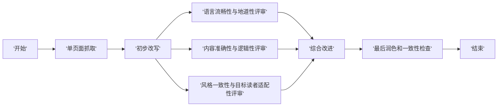

# 1.11.x 工作流集合

本文件包含1.11.x版本的所有工作流定义

==================================================
1.11.x 工作流基本变量和结构
==================================================

## 顶层结构

```yaml
app:
  description: ''
  icon: 🤖
  icon_background: '#D1E9FF'
  mode: [advanced-chat, completion, workflow, chat, agent-chat]
  name: 工作流名称
  use_icon_as_answer_icon: false

dependencies:
- current_identifier: null
  type: marketplace
  value:
    marketplace_plugin_unique_identifier: 插件标识符
    version: null

kind: app
version: 0.5.0
```

## Workflow 结构

```yaml
workflow:
  conversation_variables: []  # 会话变量
  environment_variables: []    # 环境变量
  features: {}                 # 功能配置
  graph: {}                    # 工作流图结构
  rag_pipeline_variables: []   # RAG管道变量
```

## 会话变量结构

```yaml
conversation_variables:
- description: ''
  id: uuid
  name: 变量名
  selector:
  - conversation
  - 变量名
  value: 默认值
  value_type: [string, number, boolean, array, array[string], array[number]]
```

## 功能配置

```yaml
features:
  file_upload:
    allowed_file_extensions: []
    allowed_file_types: []
    allowed_file_upload_methods: []
    enabled: false
    fileUploadConfig: {}
    image: {}
    number_limits: 3
  opening_statement: ''
  retriever_resource:
    enabled: true/false
  sensitive_word_avoidance:
    enabled: false
  speech_to_text:
    enabled: false
  suggested_questions: []
  suggested_questions_after_answer:
    enabled: false
  text_to_speech:
    enabled: false
    language: ''
    voice: ''
```

## 工作流图结构

```yaml
graph:
  edges: []  # 边列表
  nodes: []  # 节点列表
  viewport: {}
```

## 边结构

```yaml
edges:
- data:
    isInIteration: true/false
    iteration_id: ''
    sourceType: 源节点类型
    targetType: 目标节点类型
  id: 边ID
  selected: false
  source: 源节点ID
  sourceHandle: source/true/false
  target: 目标节点ID
  targetHandle: target
  type: custom
  zIndex: 0
```

## 节点类型和属性

### 开始节点 (start)
```yaml
- data:
    desc: ''
    selected: false
    title: 开始
    type: start
    variables: []  # 输入变量
  height: 90
  id: 节点ID
  position: {}
  positionAbsolute: {}
  selected: false
  sourcePosition: right
  targetPosition: left
  type: custom
  width: 244
```

### 结束节点 (end)
```yaml
- data:
    desc: ''
    outputs: []  # 输出变量
    selected: false
    title: 结束
    type: end
  height: 89
  id: 节点ID
  position: {}
  positionAbsolute: {}
  selected: false
  sourcePosition: right
  targetPosition: left
  type: custom
  width: 244
```

### LLM节点 (llm)
```yaml
- data:
    context: {}
    desc: ''
    memory: {}
    model: {}
    prompt_template: []
    selected: false
    title: LLM
    type: llm
    variables: []
    vision: {}
  height: 90
  id: 节点ID
  position: {}
  positionAbsolute: {}
  selected: false
  sourcePosition: right
  targetPosition: left
  type: custom
  width: 244
```

### HTTP请求节点 (http-request)
```yaml
- data:
    authorization: {}
    body: {}
    desc: ''
    headers: ''
    method: [get, post, put, delete]
    params: ''
    selected: false
    timeout: {}
    title: HTTP Request
    type: http-request
    url: https://example.com
    variables: []
  height: 137
  id: 节点ID
  position: {}
  positionAbsolute: {}
  selected: false
  sourcePosition: right
  targetPosition: left
  type: custom
  width: 244
```

### 条件分支节点 (if-else)
```yaml
- data:
    cases: []
    desc: ''
    selected: false
    title: IF/ELSE
    type: if-else
  height: 126
  id: 节点ID
  position: {}
  positionAbsolute: {}
  selected: false
  sourcePosition: right
  targetPosition: left
  type: custom
  width: 244
```

### 变量赋值节点 (assigner)
```yaml
- data:
    desc: ''
    items: []
    selected: false
    title: 变量赋值
    type: assigner
    version: '2'
  height: 88
  id: 节点ID
  position: {}
  positionAbsolute: {}
  selected: false
  sourcePosition: right
  targetPosition: left
  type: custom
  width: 244
```

### 代码执行节点 (code)
```yaml
- data:
    code: ''
    code_language: python3
    desc: ''
    outputs: {}
    selected: false
    title: 代码执行
    type: code
    variables: []
  height: 54
  id: 节点ID
  position: {}
  positionAbsolute: {}
  selected: false
  sourcePosition: right
  targetPosition: left
  type: custom
  width: 244
```

### 问题分类节点 (question-classifier)
```yaml
- data:
    classes: []
    desc: ''
    instructions: ''
    model: {}
    query_variable_selector: []
    selected: false
    title: Question Classifier
    topics: []
    type: question-classifier
  height: 231
  id: 节点ID
  position: {}
  positionAbsolute: {}
  selected: false
  sourcePosition: right
  targetPosition: left
  type: custom
  width: 244
```

### 变量聚合器节点 (variable-aggregator)
```yaml
- data:
    desc: ''
    output_type: string
    selected: false
    title: Variable Aggregator
    type: variable-aggregator
    variables: []
  height: 164
  id: 节点ID
  position: {}
  positionAbsolute: {}
  selected: false
  sourcePosition: right
  targetPosition: left
  type: custom
  width: 244
```

### 模板转换节点 (template-transform)
```yaml
- data:
    desc: ''
    selected: false
    template: ''
    title: 模板转换
    type: template-transform
    variables: []
  height: 54
  id: 节点ID
  position: {}
  positionAbsolute: {}
  selected: false
  sourcePosition: right
  targetPosition: left
  type: custom
  width: 244
```

## 迭代节点结构

```yaml
- data:
    desc: ''
    error_handle_mode: terminated
    height: 1042
    is_parallel: false
    iterator_selector: []
    output_selector: []
    output_type: array[string]
    parallel_nums: 10
    selected: false
    start_node_id: 迭代开始节点ID
    title: 迭代
    type: iteration
    width: 1186
  height: 1042
  id: 节点ID
  position: {}
  positionAbsolute: {}
  selected: false
  sourcePosition: right
  targetPosition: left
  type: custom
  width: 1186
  zIndex: 1
```

## 迭代开始节点结构

```yaml
- data:
    desc: ''
    isInIteration: true
    selected: false
    title: ''
    type: iteration-start
  draggable: false
  height: 48
  id: 迭代开始节点ID
  parentId: 迭代节点ID
  position: {}
  positionAbsolute: {}
  selectable: false
  sourcePosition: right
  targetPosition: left
  type: custom-iteration-start
  width: 44
  zIndex: 1002
```

## 工具节点结构

```yaml
- data:
    desc: ''
    provider_id: 工具提供商ID
    provider_name: 工具名称
    provider_type: builtin/marketplace
    selected: false
    title: 工具名称
    tool_configurations: {}
    tool_label: 工具标签
    tool_name: 工具函数名
    tool_node_version: '2'
    tool_parameters: {}
    type: tool
  height: 324
  id: 节点ID
  parentId: 父节点ID
  position: {}
  positionAbsolute: {}
  selected: false
  sourcePosition: right
  targetPosition: left
  type: custom
  width: 244
  zIndex: 1002
```

## 文档提取器节点 (document-extractor)

```yaml
- data:
    desc: ''
    selected: false
    title: 文档提取器
    type: document-extractor
  height: 90
  id: 节点ID
  position: {}
  positionAbsolute: {}
  selected: false
  sourcePosition: right
  targetPosition: left
  type: custom
  width: 244
```

## 回答节点 (answer)

```yaml
- data:
    answer: ''
    desc: ''
    selected: false
    title: 回答
    type: answer
    variables: []
  height: 105
  id: answer
  position: {}
  positionAbsolute: {}
  selected: false
  sourcePosition: right
  targetPosition: left
  type: custom
  width: 244
```

## 节点输入/输出变量结构

```yaml
variables:
- label: 变量标签
  max_length: 48
  options: []
  required: true/false
  type: [text, paragraph, number, select, boolean, array]
  variable: 变量名
```

## 节点输出配置

```yaml
outputs:
- value_selector:
  - 源节点ID
  - 输出属性名
  variable: 输出变量名
```

## 视图配置

```yaml
viewport:
  x: 0
  y: 0
  zoom: 1
```

## 依赖结构

```yaml
dependencies:
- current_identifier: null
  type: marketplace
  value:
    marketplace_plugin_unique_identifier: 插件唯一标识符
    version: null
```

## 模型配置

```yaml
model:
  completion_params:
    frequency_penalty: 0
    max_tokens: 512
    presence_penalty: 0
    temperature: 0.7
    top_p: 1
  mode: chat
  name: 模型名称
  provider: 提供商/模型路径
```

## 内存配置

```yaml
memory:
  query_prompt_template: ''
  role_prefix:
    assistant: ''
    user: ''
  window:
    enabled: false
    size: 50
```

## 上下文配置

```yaml
context:
  enabled: false
  variable_selector: []
```

## 代码节点输出配置

```yaml
outputs:
  输出名称:
    children: null
    type: 输出类型
```

## HTTP请求配置

```yaml
authorization:
  config: null
  type: no-auth
body:
  data: ''
  type: none
headers: ''
method: get
params: ''
timeout:
  connect: 10
  max_connect_timeout: 300
  max_read_timeout: 600
  max_write_timeout: 600
  read: 60
  write: 20
url: https://example.com
```

## 条件分支配置

```yaml
cases:
- case_id: 'true'
  conditions:
  - comparison_operator: is
    id: 条件ID
    value: 'True'
    varType: string
    variable_selector: []
  id: 'true'
  logical_operator: and
```

## 工具参数配置

```yaml
tool_parameters:
  参数名:
    type: mixed
    value: 变量引用
```

## 模板参数配置

```yaml
template: ''
variables:
- value_selector: []
  variable: 变量名
```

## 1.11.x 版本支持的工作流模式

- `advanced-chat`: 高级聊天模式
- `completion`: 完成模式
- `workflow`: 工作流模式
- `chat`: 聊天模式
- `agent-chat`: 智能体聊天模式

## 1.11.x 版本支持的节点类型

- `start`: 开始节点
- `end`: 结束节点
- `llm`: 大语言模型节点
- `http-request`: HTTP请求节点
- `if-else`: 条件分支节点
- `assigner`: 变量赋值节点
- `code`: 代码执行节点
- `question-classifier`: 问题分类节点
- `variable-aggregator`: 变量聚合器节点
- `template-transform`: 模板转换节点
- `iteration`: 迭代节点
- `iteration-start`: 迭代开始节点
- `tool`: 工具节点
- `document-extractor`: 文档提取器节点
- `answer`: 回答节点

## 1.11.x 版本支持的变量类型

- `string`: 字符串
- `paragraph`: 段落文本
- `number`: 数字
- `select`: 下拉选择
- `boolean`: 布尔值
- `array`: 数组
- `array[string]`: 字符串数组
- `array[number]`: 数字数组
- `array[object]`: 对象数组

## 1.11.x 版本支持的模型提供商

- `openai`: OpenAI模型
- `deepseek`: DeepSeek模型
- `gemini-2.0-flash-exp`: Google Gemini模型
- 其他市场插件模型

## 1.11.x 版本支持的工具

- `json_process`: JSON处理工具
- `tavily_search`: Tavily搜索工具
- 其他市场插件工具

## 1.11.x 版本支持的HTTP方法

- `get`: GET请求
- `post`: POST请求
- `put`: PUT请求
- `delete`: DELETE请求
- `patch`: PATCH请求

## 1.11.x 版本支持的代码语言

- `python3`: Python 3

## 1.11.x 版本支持的文件类型

- 图片文件 (JPG, JPEG, PNG, GIF, WEBP, SVG)
- 文本文件
- 文档文件
- 音频文件
- 视频文件

## 1.11.x 版本支持的授权类型

- `no-auth`: 无需授权
- API Key授权
- OAuth授权
- 其他自定义授权类型

## 1.11.x 版本支持的比较运算符

- `is`: 等于
- `is_not`: 不等于
- `contains`: 包含
- `not_contains`: 不包含
- `starts_with`: 以...开头
- `ends_with`: 以...结尾
- `greater_than`: 大于
- `less_than`: 小于
- `greater_than_or_equal`: 大于等于
- `less_than_or_equal`: 小于等于

## 1.11.x 版本支持的逻辑运算符

- `and`: 逻辑与
- `or`: 逻辑或

## 1.11.x 版本支持的迭代模式

- 串行迭代
- 并行迭代

## 1.11.x 版本支持的错误处理模式

- `terminated`: 终止
- `continue`: 继续

## 1.11.x 版本支持的工作流导出格式

- YAML
- JSON

## 1.11.x 版本支持的工作流导入格式

- YAML

## 1.11.x 版本的主要特性

- 支持多种工作流模式
- 丰富的节点类型
- 灵活的变量管理
- 强大的模型集成
- 支持代码执行
- 支持HTTP请求
- 支持迭代和条件分支
- 支持工具调用
- 支持文档处理
- 支持知识库检索
- 支持多模态输入
- 可视化工作流设计
- 工作流模板支持
- 版本控制
- 协作编辑
- API集成支持
- 插件扩展机制

## 1.11.x 版本的部署方式

- 本地部署
- 云端部署
- 容器化部署
- Serverless部署

## 1.11.x 版本的API支持

- REST API
- GraphQL API
- WebSocket API
- SSE (Server-Sent Events)

## 1.11.x 版本的监控和日志

- 工作流执行日志
- 节点执行监控
- 性能统计
- 错误追踪
- 审计日志

## 1.11.x 版本的安全特性

- 敏感词过滤
- 权限控制
- 数据加密
- 访问令牌管理
- 安全审计
- 输入验证
- 输出审查

## 1.11.x 版本的扩展机制

- 自定义节点开发
- 插件开发
- 模型集成
- 工具集成
- 模板开发
- 主题定制

## 1.11.x 版本的集成能力

- 第三方API集成
- 数据库集成
- 消息队列集成
- 存储服务集成
- 监控系统集成
- CI/CD集成

## 1.11.x 版本的开发工具

- 可视化工作流编辑器
- 代码编辑器
- 调试工具
- 测试工具
- 部署工具
- 版本管理工具

## 1.11.x 版本的支持平台

- Web浏览器
- 桌面应用
- 移动应用
- 命令行工具

## 1.11.x 版本的文档支持

- 在线文档
- API文档
- 教程和示例
- 最佳实践指南
- 故障排除指南

## 1.11.x 版本的社区支持

- GitHub仓库
- 社区论坛
- Discord/Slack频道
- 定期更新
- 问题追踪
- 功能请求
- 贡献指南

## 1.11.x 版本的许可证

- 开源许可证
- 商业许可证
- 企业许可证

## 1.11.x 版本的系统要求

- 操作系统: Linux, Windows, macOS
- 内存: 至少4GB RAM
- CPU: 至少2核CPU
- 存储: 至少10GB可用空间
- 网络: 稳定的互联网连接

## 1.11.x 版本的安装方式

- Docker安装
- 源码安装
- 包管理器安装
- 一键安装脚本

## 1.11.x 版本的升级方式

- 在线升级
- 手动升级
- 容器镜像更新
- 源码更新

## 1.11.x 版本的备份和恢复

- 工作流备份
- 配置备份
- 数据备份
- 灾难恢复

## 1.11.x 版本的性能优化

- 缓存机制
- 异步执行
- 并行处理
- 资源池管理
- 自动扩展

## 1.11.x 版本的可用性保障

- 高可用性架构
- 负载均衡
- 故障转移
- 冗余设计
- 监控告警

## 1.11.x 版本的合规性

- GDPR
- CCPA
- HIPAA
- SOC 2
- ISO 27001
- 其他行业标准

## 1.11.x 版本的未来规划

- 更多模型支持
- 更多工具集成
- 增强的可视化编辑
- 更好的协作功能
- 更强大的自动化能力
- 改进的性能和可扩展性
- 更多的集成选项
- 增强的安全特性
- 更好的开发者体验
- 更多的行业解决方案

## 1.11.x 版本的常见用例

- 智能客服
- 内容生成
- 数据分析
- 自动化工作流
- 知识库管理
- 虚拟助手
- 代码生成
- 文档处理
- 翻译服务
- 图像生成
- 语音处理
- 视频处理
- 社交媒体管理
- 营销自动化
- 销售自动化
- 人力资源自动化
- 财务自动化
- 供应链管理
- 物流管理
- 医疗健康应用
- 教育应用
- 科研应用
- 政府应用
- 企业内部工具

==================================================
1.11.x 工作流基本变量和结构 - 结束
==================================================

==================================================
工作流 1/11: DeepResearch.md
==================================================

# DeepResearch

## 基本信息

- **名称**: DeepResearch
- **描述**: 
- **模式**: advanced-chat
- **版本**: 0.5.0
- **图标**: 🤖
- **原始文件名**: DeepResearch.yml
- **知识库功能**: 已启用

## 节点列表

### 开始 (start)

- **ID**: 1739229221219
- **描述**: 

### 回答 (answer)

- **ID**: answer
- **描述**: 

### 迭代 (iteration)

- **ID**: 1739244888446
- **描述**: 

###  (iteration-start)

- **ID**: 1739244888446start
- **描述**: 

### LLM (llm)

- **ID**: 1739245286499
- **描述**: 
- **模型**: gpt-4o
- **上下文启用**: 否

### Tavily Search (tool)

- **ID**: 1739245424964
- **描述**: 

### 提取nextSearchTopic (tool)

- **ID**: 1739245446901
- **描述**: 

### 提取shouldContinue (tool)

- **ID**: 1739245524260
- **描述**: 

### 创建数组 (code)

- **ID**: 1739245548624
- **描述**: 
- **代码语言**: python3

### IF/ELSE (if-else)

- **ID**: 1739245723720
- **描述**: 

### 变量赋值 (assigner)

- **ID**: 1739245826988
- **描述**: 

### 变量赋值 (assigner)

- **ID**: 1739246085820
- **描述**: 

### Reasoning Model (llm)

- **ID**: 1739246156652
- **描述**: 
- **模型**: deepseek-reasoner
- **上下文启用**: 否

### 回答 (answer)

- **ID**: 1739253994297
- **描述**: 

### 中感出力フォーマット (template-transform)

- **ID**: 1739254060247
- **描述**: 

### 变量聚合器 (variable-aggregator)

- **ID**: 1739254296073
- **描述**: 

### 空白 (template-transform)

- **ID**: 1739254516383
- **描述**: 

## 工作流逻辑

```mermaid
flowchart LR
    'iteration-start' --> 'LLM'
    'LLM' --> '提取nextSearchTopic'
    'LLM' --> '提取shouldContinue'
    '开始' --> '创建数组'
    '创建数组' --> '迭代'
    'IF/ELSE' --> 'Tavily Search'
    '提取nextSearchTopic' --> '变量赋值'
    'Tavily Search' --> '变量赋值'
    '迭代' --> 'Reasoning Model'
    'Reasoning Model' --> '回答'
    '提取shouldContinue' --> '变量赋值'
    '变量赋值' --> 'IF/ELSE'
    '变量赋值' --> '中感出力フォーマット'
    '中感出力フォーマット' --> '变量聚合器'
    '变量聚合器' --> '回答'
    'IF/ELSE' --> '空白'
    '空白' --> '变量聚合器'
```

## 工作流总结

本工作流包含知识库检索功能，使用23个节点构建了完整的工作流逻辑。

### 核心功能


==================================================
工作流 2/11: SQL 生成器.md
==================================================

# SQL 生成器

## 基本信息

- **名称**: SQL 生成器
- **描述**: 
- **模式**: completion
- **版本**: 0.5.0
- **图标**: 🤖
- **原始文件名**: SQL 生成器.yml
- **知识库功能**: 未启用

## 节点列表

## 工作流逻辑

```mermaid
flowchart LR
```

## 工作流总结

本工作流不包含知识库检索功能，使用0个节点构建了完整的工作流逻辑。

### 核心功能


==================================================
工作流 3/11: YouTube 频道数据分析.md
==================================================

# YouTube 频道数据分析

## 基本信息

- **名称**: YouTube 频道数据分析
- **描述**: 
- **模式**: agent-chat
- **版本**: 0.5.0
- **图标**: 🤖
- **原始文件名**: YouTube 频道数据分析.yml
- **知识库功能**: 未启用

## 节点列表

## 工作流逻辑

```mermaid
flowchart LR
```

## 工作流总结

本工作流不包含知识库检索功能，使用0个节点构建了完整的工作流逻辑。

### 核心功能


==================================================
工作流 4/11: 个性化记忆助手.md
==================================================

# 个性化记忆助手

## 基本信息

- **名称**: 个性化记忆助手
- **描述**: 
- **模式**: advanced-chat
- **版本**: 0.5.0
- **图标**: 🤖
- **原始文件名**: 个性化记忆助手.yml
- **知识库功能**: 未启用

## 节点列表

### 开始 (start)

- **ID**: 1723433389887
- **描述**: 

### Answer（2） (answer)

- **ID**: answer
- **描述**: 

### 判断 query 是否存在需要记忆的部分 (llm)

- **ID**: 1723439627061
- **描述**: 
- **模型**: gpt-4o
- **上下文启用**: 否

### 条件分支 (if-else)

- **ID**: 1723440384014
- **描述**: 

### 提取记忆 (llm)

- **ID**: 1723440416057
- **描述**: 
- **模型**: gpt-4o
- **上下文启用**: 否

### 将提取的记忆写入会话变量 (assigner)

- **ID**: 1723440950024
- **描述**: 

### 将字符串转义为 object (code)

- **ID**: 1723441002334
- **描述**: 
- **代码语言**: python3

### 根据记忆回复 (llm)

- **ID**: 1723442720119
- **描述**: 
- **模型**: gpt-4o
- **上下文启用**: 否

### 根据记忆回答 (llm)

- **ID**: 17234428530880
- **描述**: 
- **模型**: gpt-4o
- **上下文启用**: 否

### Answer (1) (answer)

- **ID**: 17234428657830
- **描述**: 

### 将 object 转义为字符串 (code)

- **ID**: 1723443740666
- **描述**: 
- **代码语言**: python3

### 将object 转义为字符串 (code)

- **ID**: 1723444029520
- **描述**: 
- **代码语言**: python3

## 工作流逻辑

```mermaid
flowchart LR
    '开始' --> '判断 query 是否存在需要记忆的部分'
    '判断 query 是否存在需要记忆的部分' --> '条件分支'
    '条件分支' --> '提取记忆'
    '提取记忆' --> '将字符串转义为 object'
    '将字符串转义为 object' --> '将提取的记忆写入会话变量'
    '根据记忆回复' --> 'Answer（2）'
    '根据记忆回答' --> 'Answer (1)'
    '条件分支' --> '将 object 转义为字符串'
    '将 object 转义为字符串' --> '根据记忆回答'
    '将提取的记忆写入会话变量' --> '将object 转义为字符串'
    '将object 转义为字符串' --> '根据记忆回复'
```

## 工作流总结

本工作流不包含知识库检索功能，使用18个节点构建了完整的工作流逻辑。

### 核心功能

- 大语言模型调用, 代码执行


==================================================
工作流 5/11: 代码转换器.md
==================================================

# 代码转换器

## 基本信息

- **名称**: 代码转换器
- **描述**: 
- **模式**: completion
- **版本**: 0.5.0
- **图标**: 🤖
- **原始文件名**: 代码转换器.yml
- **知识库功能**: 未启用

## 节点列表

## 工作流逻辑

```mermaid
flowchart LR
```

## 工作流总结

本工作流不包含知识库检索功能，使用0个节点构建了完整的工作流逻辑。

### 核心功能


==================================================
工作流 6/11: 会议纪要.md
==================================================

# 会议纪要

## 基本信息

- **名称**: 会议纪要
- **描述**: 
- **模式**: chat
- **版本**: 0.5.0
- **图标**: 🤖
- **原始文件名**: 会议纪要.yml
- **知识库功能**: 未启用

## 节点列表

## 工作流逻辑

```mermaid
flowchart LR
```

## 工作流总结

本工作流不包含知识库检索功能，使用0个节点构建了完整的工作流逻辑。

### 核心功能


==================================================
工作流 7/11: 客户评价处理工作流.md
==================================================

# 客户评价处理工作流

## 基本信息

- **名称**: 客户评价处理工作流
- **描述**: 
- **模式**: workflow
- **版本**: 0.5.0
- **图标**: 🤖
- **原始文件名**: 客户评价处理工作流.yml
- **知识库功能**: 未启用

## 节点列表

### Start (start)

- **ID**: 1711529033302
- **描述**: 

### Question Classifier (question-classifier)

- **ID**: 1711529036587
- **描述**: 定义一个用户问题的主题分类，主题定义了对话的进展方式

### HTTP Request (http-request)

- **ID**: 1711529059204
- **描述**: 发送正面评价至公司品牌宣传部门的系统
- **请求方法**: get
- **URL**: https://www.example.com

### Question Classifier 2 (question-classifier)

- **ID**: 1711529066687
- **描述**: 定义一个用户问题的主题分类，主题定义了对话的进展方式

### HTTP Request 2 (http-request)

- **ID**: 1711529077513
- **描述**: 发送运输类负面评价至运输部门
- **请求方法**: get
- **URL**: https://www.example.com

### HTTP Request 3 (http-request)

- **ID**: 1711529078719
- **描述**: 发送运输类负面评价至产品体验部门
- **请求方法**: get
- **URL**: https://www.example.com

### Variable Aggregator (variable-aggregator)

- **ID**: 1718995432944
- **描述**: 

### End (end)

- **ID**: 1718995448481
- **描述**: 

## 工作流逻辑

```mermaid
flowchart LR
    'Start' --> 'Question Classifier'
    'Question Classifier' --> 'HTTP Request'
    'Question Classifier' --> 'Question Classifier 2'
    'Question Classifier 2' --> 'HTTP Request 2'
    'Question Classifier 2' --> 'HTTP Request 3'
    'HTTP Request' --> 'Variable Aggregator'
    'HTTP Request 2' --> 'Variable Aggregator'
    'HTTP Request 3' --> 'Variable Aggregator'
    'Variable Aggregator' --> 'End'
```

## 工作流总结

本工作流不包含知识库检索功能，使用11个节点构建了完整的工作流逻辑。

### 核心功能

- HTTP请求


==================================================
工作流 8/11: 文件翻译.md
==================================================

# 文件翻译

## 基本信息

- **名称**: 文件翻译
- **描述**: 
- **模式**: advanced-chat
- **版本**: 0.5.0
- **图标**: 🤖
- **原始文件名**: 文件翻译.yml
- **知识库功能**: 未启用

## 节点列表

### 开始 (start)

- **ID**: 1727234055352
- **描述**: 

### 文档提取器 (document-extractor)

- **ID**: 1727235420145
- **描述**: 

### 条件分支 (if-else)

- **ID**: 1727235780030
- **描述**: 

### 变量赋值 (assigner)

- **ID**: 1727243290238
- **描述**: 

### 直接回复 (answer)

- **ID**: 1727243331745
- **描述**: 

### LLM 翻译 (llm)

- **ID**: 1727244691213
- **描述**: 
- **模型**: gpt-4o
- **上下文启用**: 否

### 直接回复 (answer)

- **ID**: 1727244764225
- **描述**: 

### LLM 翻译 (llm)

- **ID**: 17272454043470
- **描述**: 
- **模型**: gpt-4o
- **上下文启用**: 否

### 直接回复 (answer)

- **ID**: 1727245512406
- **描述**: 

### 识别用户意图 (llm)

- **ID**: 1727245644467
- **描述**: 
- **模型**: gpt-4o
- **上下文启用**: 否

## 工作流逻辑

```mermaid
flowchart LR
    '条件分支' --> '文档提取器'
    '变量赋值' --> '直接回复'
    'LLM 翻译' --> '直接回复'
    'LLM 翻译' --> '直接回复'
    '识别用户意图' --> 'LLM 翻译'
    '条件分支' --> '识别用户意图'
    '开始' --> '条件分支'
    '文档提取器' --> '变量赋值'
    '直接回复' --> 'LLM 翻译'
```

## 工作流总结

本工作流不包含知识库检索功能，使用19个节点构建了完整的工作流逻辑。

### 核心功能

- 大语言模型调用


==================================================
工作流 9/11: 文本情感分析工作流.md
==================================================

# 文本情感分析工作流

## 基本信息

- **名称**: 文本情感分析工作流
- **描述**: 
- **模式**: workflow
- **版本**: 0.5.0
- **图标**: 🤖
- **原始文件名**: 文本情感分析工作流.yml
- **知识库功能**: 未启用

## 节点列表

### 开始 (start)

- **ID**: 1711708591503
- **描述**: 

### 多情绪为假 (llm)

- **ID**: 1711708651402
- **描述**: 
- **模型**: gpt-3.5-turbo
- **上下文启用**: 否

### 结束 2 (end)

- **ID**: 1711708653229
- **描述**: 

### 条件分支 (if-else)

- **ID**: 1711708770787
- **描述**: 

### 多重情感为真 (llm)

- **ID**: 1711708925268
- **描述**: 
- **模型**: gpt-3.5-turbo
- **上下文启用**: 否

### 结束 (end)

- **ID**: 1712457684421
- **描述**: 

## 工作流逻辑

```mermaid
flowchart LR
    '多情绪为假' --> '结束 2'
    '开始' --> '条件分支'
    '多重情感为真' --> '结束'
    '条件分支' --> '多情绪为假'
    '条件分支' --> '多重情感为真'
```

## 工作流总结

本工作流不包含知识库检索功能，使用8个节点构建了完整的工作流逻辑。

### 核心功能

- 大语言模型调用


==================================================
工作流 10/11: 文润 · 妙笔生花.md
==================================================

# 文润 · 妙笔生花

## 基本信息

- **名称**: 文润 · 妙笔生花
- **描述**: 
- **模式**: workflow
- **版本**: 0.5.0
- **图标**: 🤖
- **原始文件名**: 文润 · 妙笔生花.yml
- **知识库功能**: 已启用

## 节点列表

### 开始 (start)

- **ID**: 1739416823091
- **描述**: 输入文章链接

### 单页面抓取 (tool)

- **ID**: 1739416889031
- **描述**: 使用 FireCrawl 抓取页面，返回 markdown 格式

### 初步改写 (llm)

- **ID**: 1739417108713
- **描述**: 使用 Google Gemini2.0 Flash 初步改写，并去除文章无关部分
- **模型**: gemini-2.0-flash-exp
- **上下文启用**: 是

### 综合改进 (llm)

- **ID**: 1739418260707
- **描述**: 使用 Gemini 2.0 对原文和三个翻译版本进行综合分析，输出高质量的最终版本
- **模型**: gemini-2.0-flash-exp
- **上下文启用**: 否

### 结束 (end)

- **ID**: 1739419827927
- **描述**: 输出翻译后的 markdown 文章

### 语言流畅性与地道性评审 (llm)

- **ID**: 1739591458587
- **描述**: 专精于评估中文文本的流畅性、地道性和自然度
- **模型**: Qwen/Qwen2.5-14B-Instruct
- **上下文启用**: 否

### 内容准确性与逻辑性评审 (llm)

- **ID**: 1739591481332
- **描述**: 专精于评估文本的内容准确性、逻辑性和完整性
- **模型**: deepseek-ai/DeepSeek-R1
- **上下文启用**: 否

### 风格一致性与目标读者适配性评审 (llm)

- **ID**: 1739591485269
- **描述**: 专精于评估文本的风格一致性、目标读者适配性和整体表达效果
- **模型**: gemini-2.0-flash-exp
- **上下文启用**: 否

### 最后润色和一致性检查 (llm)

- **ID**: 1739591515940
- **描述**: 专精于文本的润色、校对和一致性检查
- **模型**: gemini-2.0-flash-exp
- **上下文启用**: 否

## 工作流逻辑



## 工作流总结

本工作流包含知识库检索功能，使用15个节点构建了完整的工作流逻辑。

### 核心功能

- 大语言模型调用


==================================================
工作流 11/11: 美股投资分析助手.md
==================================================

# 美股投资分析助手

## 基本信息

- **名称**: 美股投资分析助手
- **描述**: 
- **模式**: agent-chat
- **版本**: 0.5.0
- **图标**: 🤖
- **原始文件名**: 美股投资分析助手.yml
- **知识库功能**: 未启用

## 节点列表

## 工作流逻辑

```mermaid
flowchart LR
```

## 工作流总结

本工作流不包含知识库检索功能，使用0个节点构建了完整的工作流逻辑。

### 核心功能


