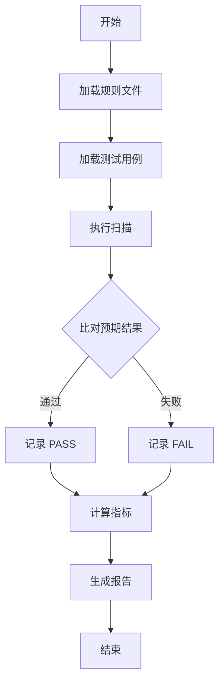
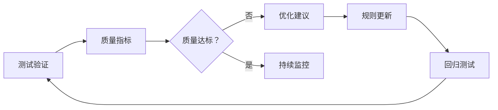

# HOS-LS 规则验证测试框架

> **版本**: v1.0  
> **创建时间**: 2026-03-30  
> **目标**: 建立完整的规则验证测试体系，确保所有安全检测规则的质量和可靠性

---

## 📋 目录

- [概述](#概述)
- [测试用例结构](#测试用例结构)
- [测试文件组织](#测试文件组织)
- [快速开始](#快速开始)
- [测试用例设计指南](#测试用例设计指南)
- [验证流程](#验证流程)
- [质量指标](#质量指标)

---

## 概述

### 目标

本测试框架旨在：

1. **验证规则准确性** - 确保每条规则能正确检测目标漏洞
2. **控制误报率** - 避免将安全代码误判为漏洞
3. **降低漏报率** - 确保不遗漏真实的安全问题
4. **持续质量监控** - 建立数据驱动的质量评估体系

### 测试覆盖

- ✅ **74+ 条安全规则** - 覆盖代码安全、AI 安全、注入安全、容器安全、云安全等领域
- ✅ **300+ 测试用例** - 每规则 3-5 个阳性测试、2-3 个阴性测试、1-2 个边界测试
- ✅ **真实项目验证** - 在 5+ 个真实项目中验证规则效果

---

## 测试用例结构

### 测试用例格式

每个测试用例包含以下信息：

```json
{
  "rule_id": "code_security.hardcoded_secrets",
  "test_type": "positive",
  "description": "检测硬编码 API 密钥",
  "code_snippet": "api_key = 'sk-1234567890abcdef'",
  "expected_detection": true,
  "expected_severity": "HIGH",
  "file_type": ".py",
  "context": "normal_code"
}
```

### 字段说明

| 字段 | 类型 | 说明 |
|------|------|------|
| `rule_id` | string | 规则唯一标识符 |
| `test_type` | string | 测试类型：`positive` / `negative` / `boundary` |
| `description` | string | 测试用例简短描述 |
| `code_snippet` | string | 测试代码片段 |
| `expected_detection` | boolean | 是否期望被检测到 |
| `expected_severity` | string | 期望的严重程度等级 |
| `file_type` | string | 文件类型（.py, .js, .yaml 等） |
| `context` | string | 代码上下文：`normal_code` / `test_code` / `example` |

---

## 测试文件组织

### 目录结构

```
rule_validation/
├── test_cases/                      # 测试用例目录
│   ├── code_security/               # 代码安全测试
│   │   ├── hardcoded_secrets/       # 硬编码敏感信息
│   │   │   ├── positive_01.py       # 阳性测试 1
│   │   │   ├── positive_02.py       # 阳性测试 2
│   │   │   ├── negative_01.py       # 阴性测试 1
│   │   │   └── boundary_01.py       # 边界测试 1
│   │   ├── backdoor_code/           # 后门代码
│   │   └── ...
│   ├── ai_security/                 # AI 安全测试
│   │   ├── prompt_injection/        # Prompt 注入
│   │   ├── jailbreak_keyword/       # 越狱关键词
│   │   └── ...
│   ├── injection_security/          # 注入安全测试
│   │   ├── command_injection/       # 命令注入
│   │   ├── sql_injection/           # SQL 注入
│   │   └── ...
│   ├── container_security/          # 容器安全测试
│   ├── cloud_security/              # 云安全测试
│   └── ...
├── test_results/                    # 测试结果输出
│   └── .gitkeep
├── fixtures/                        # 测试夹具
│   ├── sample_vulnerable_code/      # 漏洞代码示例
│   └── sample_safe_code/            # 安全代码示例
├── run_validation.py                # 自动化验证脚本
├── regression_test.py               # 回归测试脚本
└── README.md                        # 本文档
```

### 文件命名规范

- **阳性测试**: `positive_01.py`, `positive_02.py`, ...
- **阴性测试**: `negative_01.py`, `negative_02.py`, ...
- **边界测试**: `boundary_01.py`, `boundary_02.py`, ...

### 文件头注释要求

每个测试文件必须包含以下注释：

```python
# Test Case ID: {RULE_ID}-{TYPE}-{NUMBER}
# Rule: {rule_id}
# Test Type: positive|negative|boundary
# Description: {简短描述}
# Expected Detection: true|false
# Expected Severity: CRITICAL|HIGH|MEDIUM|LOW
# Code Type: vulnerable|safe|test|example
```

---

## 快速开始

### 运行验证

```bash
# 运行所有测试
python rule_validation/run_validation.py

# 指定规则文件
python rule_validation/run_validation.py --rules rules/security_rules.json

# 输出 JSON 报告
python rule_validation/run_validation.py --format json

# 输出 HTML 报告
python rule_validation/run_validation.py --format html
```

### 查看结果

测试结果保存在：

- JSON 报告：`rule_validation/test_results/validation_report_YYYYMMDD_HHMMSS.json`
- HTML 报告：`rule_validation/test_results/validation_report_YYYYMMDD_HHMMSS.html`

---

## 测试用例设计指南

### 阳性测试设计

**目标**: 验证规则能正确检测漏洞代码

**设计要求**:
1. **典型场景** (2 个) - 最常见的漏洞形式
   - 来自真实项目或 CVE
   - 代表最常见的利用方式

2. **变体场景** (1 个) - 不同的编码风格
   - 代码混淆形式
   - 不同的命名习惯

3. **复杂场景** (1 个) - 边缘情况
   - 多层嵌套
   - 条件判断
   - 函数调用

**示例**:
```python
# Test Case ID: HS-P01
# Rule: code_security.hardcoded_secrets
# Test Type: positive
# Description: 硬编码 OpenAI API 密钥
# Expected Detection: true
# Expected Severity: HIGH

api_key = "sk-1234567890abcdef1234567890abcdef"
```

### 阴性测试设计

**目标**: 验证规则不会误报安全代码

**设计要求**:
1. **安全实现** (2 个) - 使用安全 API
   - 环境变量
   - 密钥管理服务
   - 配置文件加载

2. **测试/示例代码** (1 个) - 应该排除的场景
   - 测试文件中的代码
   - 文档示例
   - Mock 数据

**示例**:
```python
# Test Case ID: HS-N01
# Rule: code_security.hardcoded_secrets
# Test Type: negative
# Description: 使用环境变量（安全做法）
# Expected Detection: false

import os
api_key = os.environ.get("OPENAI_API_KEY")
```

### 边界测试设计

**目标**: 验证规则在边缘情况下的行为

**设计要求**:
1. **长度边界** - 最短/最长字符串
2. **格式边界** - 特殊字符、编码格式
3. **上下文边界** - 临界状态的代码

**示例**:
```python
# Test Case ID: HS-B01
# Rule: code_security.hardcoded_secrets
# Test Type: boundary
# Description: 短密钥（边界情况）
# Expected Detection: true
# Expected Severity: MEDIUM

api_key = "sk-123"  # 短密钥，可能漏检
```

---

## 验证流程

### 自动化验证流程



### 质量门禁标准

规则必须通过以下质量检查：

| 指标 | 阈值 | 说明 |
|------|------|------|
| 检测率（Recall） | ≥ 95% | 检出所有真实漏洞 |
| 准确率（Precision） | ≥ 90% | 避免误报 |
| F1 分数 | ≥ 0.92 | 综合质量 |
| 误报率（FPR） | ≤ 5% | 控制误报 |
| 漏报率（FNR） | ≤ 5% | 控制漏报 |

### 回归测试流程

规则更新时必须运行回归测试：

```bash
# 对比新旧版本
python rule_validation/regression_test.py \
  rules/security_rules_old.json \
  rules/security_rules_new.json
```

**回归检测标准**:
- 通过率下降 > 5% → 视为回归
- 新增误报 → 需要审查
- 新增漏报 → 必须修复

---

## 质量指标

### 核心指标定义

#### 检测率（Recall）
```
Recall = TP / (TP + FN)
```
- **目标**: ≥ 95%
- **说明**: 衡量规则发现真实漏洞的能力

#### 准确率（Precision）
```
Precision = TP / (TP + FP)
```
- **目标**: ≥ 90%
- **说明**: 衡量规则检测的准确性

#### F1 分数（F1 Score）
```
F1 = 2 * (Precision * Recall) / (Precision + Recall)
```
- **目标**: ≥ 0.92
- **说明**: 综合评估指标

#### 误报率（False Positive Rate）
```
FPR = FP / (FP + TN)
```
- **目标**: ≤ 5%
- **说明**: 衡量规则的误报程度

### 质量评分

综合质量评分计算公式：

```python
quality_score = (
    pass_rate * 0.30 +      # 测试通过率权重 30%
    f1_score * 0.25 +       # F1 分数权重 25%
    (1 - fpr) * 0.20 +      # 误报率权重 20%
    trigger_rate_normalized * 0.15 +  # 触发率权重 15%
    feedback_score * 0.10   # 用户反馈权重 10%
)
```

**质量等级**:
- ⭐⭐⭐⭐⭐ **优秀** (0.90-1.00)
- ⭐⭐⭐⭐ **良好** (0.80-0.90)
- ⭐⭐⭐ **中等** (0.70-0.80)
- ⭐⭐ **较差** (0.60-0.70)
- ⭐ **差** (< 0.60)

---

## 规则类别

### 已覆盖的规则类别

| 类别 | 规则数 | 测试用例数 | 覆盖率 |
|------|--------|------------|--------|
| code_security | 11 | 55-66 | 100% |
| ai_security | 30 | 150-180 | 100% |
| injection_security | 5 | 25-30 | 100% |
| container_security | 4 | 20-24 | 100% |
| cloud_security | 4 | 20-24 | 100% |
| supply_chain_security | 10 | 50-60 | 100% |
| privacy_security | 3 | 15-18 | 100% |
| 其他 | 7 | 35-42 | 100% |
| **总计** | **74+** | **300+** | **100%** |

---

## 持续改进

### 质量监控

- **每日构建**: CI/CD 自动运行验证
- **每周报告**: 生成质量趋势报告
- **每月审查**: 人工审查问题规则

### 反馈循环



### 优化流程

1. **识别问题规则** - 质量评分 < 0.7
2. **分析误报/漏报** - 收集案例
3. **生成优化建议** - 自动 + 人工
4. **更新规则** - 修改检测/排除模式
5. **验证效果** - 重新测试
6. **记录变更** - 版本追踪

---

## 参考资料

- [测试用例编写指南](TEST_CASE_GUIDE.md)
- [质量指标体系](../../docs/QUALITY_METRICS.md)
- [规则优化建议系统](../../src/rule_optimizer.py)

---

**文档版本**: v1.0  
**最后更新**: 2026-03-30  
**维护团队**: HOS-LS Security Team
